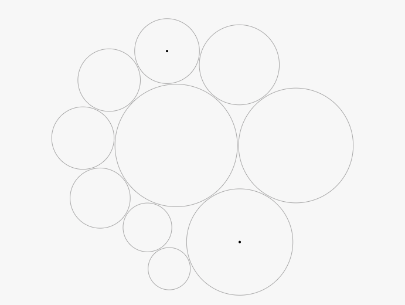

# Replicating a Classic Experiment  
 Project link: ["Experiment"](http://EFGAO.github.io/04-Experiment/index.html).
 
# Team
 - Jingjun Zhang, zhangjingjun
 - Yifei Gao, EFGAO 
# Collaboration
 - Jingjun Zhang: The frame work of HTML and javascript code;
 Including generating four type of data visualization randomly, generating two points to indicate the test chart, order the sequence of the different data vis. 
 - Yifei Gao. Implementing the data table in the last stage, export the data to csv file, calculate the error score.
 
# Experiment Intro
 In this experiment we try to figure out which chart is best out of some common chart such as bar chart, stack bar chart, pie chart and bubble chart. 
 We duplicate the experiment of Cleveland and McGill with a series of randomly generated charts.
 Participants would give an answer to "What percentage is the smaller of the larger" for 20 times for each data visualization type.
 In this experiment we invited 10 volunteer to participate the test.
 After each test, we show the experiment result and save it to csv file.
 We merge 10 csv files to a master csv file after the whole experiment and analyze the data from there.
 
 
## Bar Chart
 
 
 
## Stack Bar Chart
 
 
 
## Pie Chart
 
 
## Bubble Chart
 
 
#Experiment Result
 We use the logarithmic scale for error measurement as Cleveland and Mcgill did in order to better compare the performance of each data visualization.
 Also we handle the case which the actual percent exactly equals to participant percent: we let the result to be 0 instead of -3.
 Please refer to the `master-experiment.csv` to check the full test result.
 
 The final result is
 
 1. Bar Chart: 1.87
 2. Bubble Chart: 2.55
 3. Stack Bar Chart: 2.60
 4. Pie Chart: 2.81
 
 Surprisingly, we find that the bubble chart is exceed the stack bar chart which is contrary to the result of Cleveland & McGill's Results.
 We conclude some reasons for that: First the stack bar chart is relatively small to other charts, which increase the difficulty of judging the size of that. Second the bubble chart is clustered and it might be easier for comparing than the scattered bubble chart.
 The other result is just as we expected: The bar chart is the best chart according to the error score and participant all have poor result with the pie chart.
 
# Technical Achievements
 We use svg to create four different data visualization charts. Also we implement a function to random order the different type of the charts and randomly select two shape in one chart. We also use the table to layout the whole html page and use JavaScript to dynamically create a table with the test data we recorded. Finally, we would use the download link to automatically save a csv file.
 
 
# Design Achievements
 In this experiment, we test and compare four different chart. Besides the bar chart, stack bar chart and pie chart, we also add the bubble chart since we think the bubble chart is very common for data vis. It is meaningful to compare the performance among these four chart.
 When we randomly generate the chart, we set a minimize value to avoid the chart to be too small to evaluate. If we set a bar chart with extremely small size, it would hardly be seen from the screen. It is neither user friendly nor good to the experiment result.
 
 